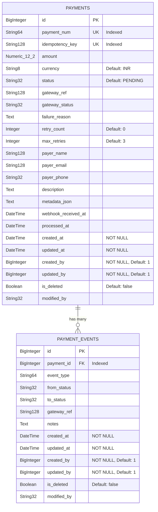
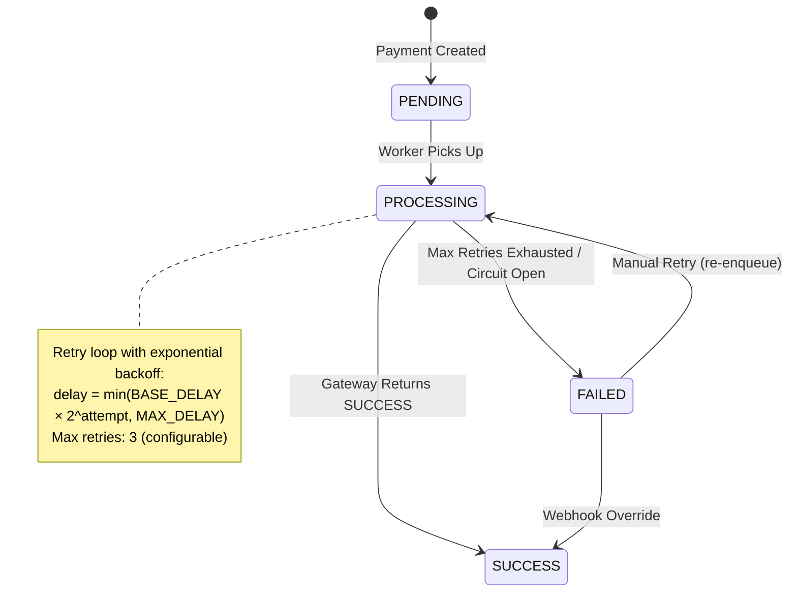
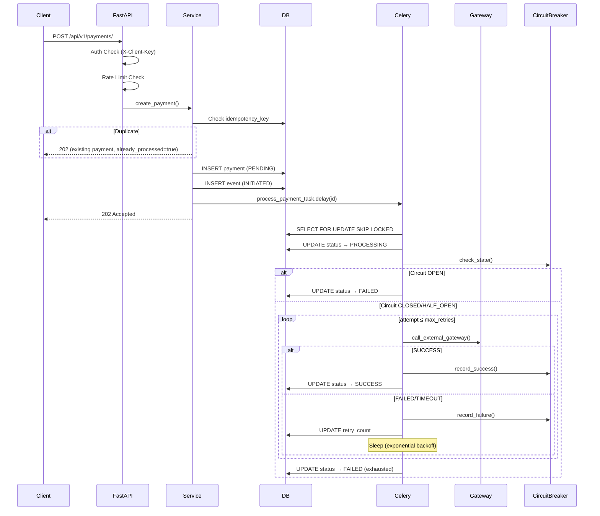
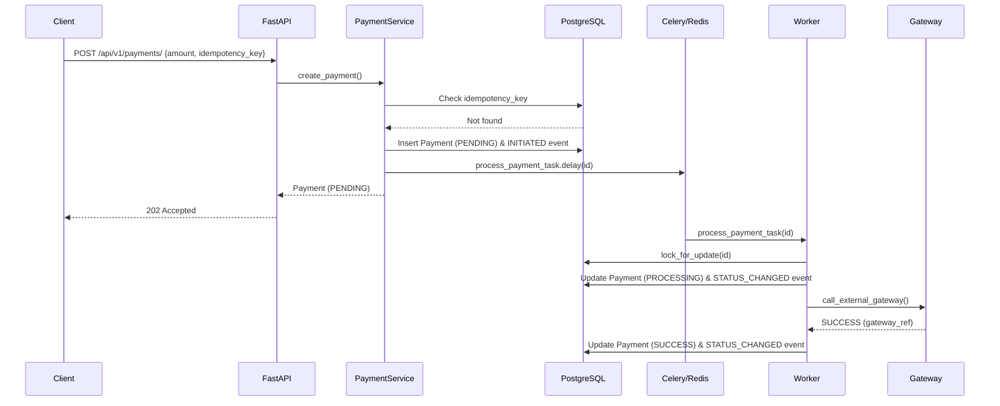
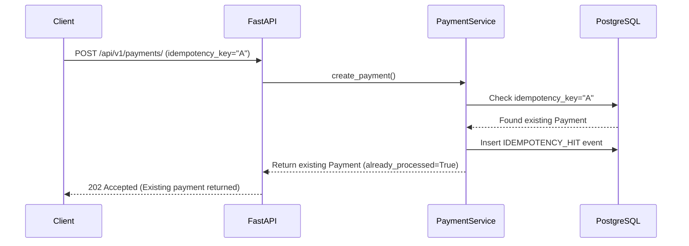
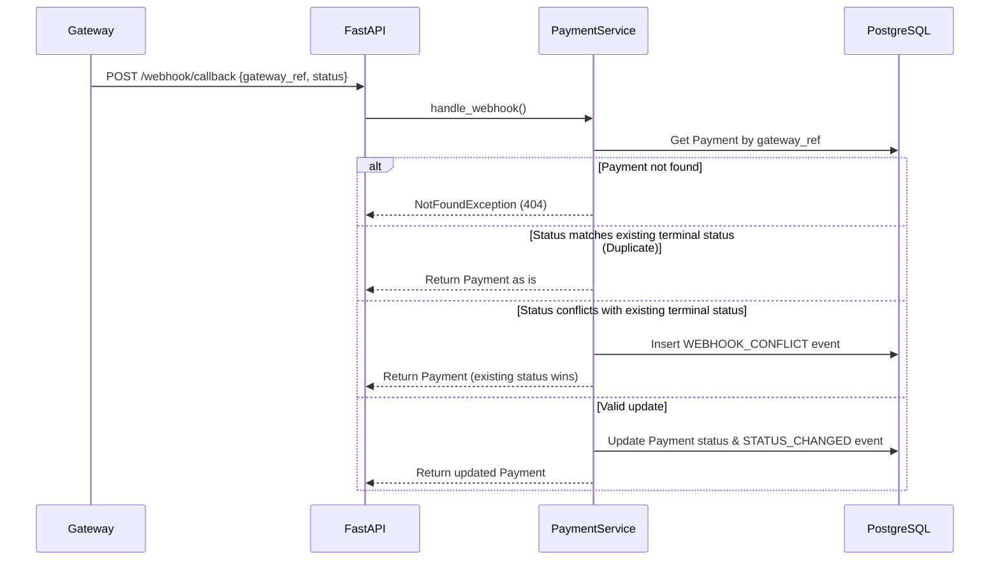
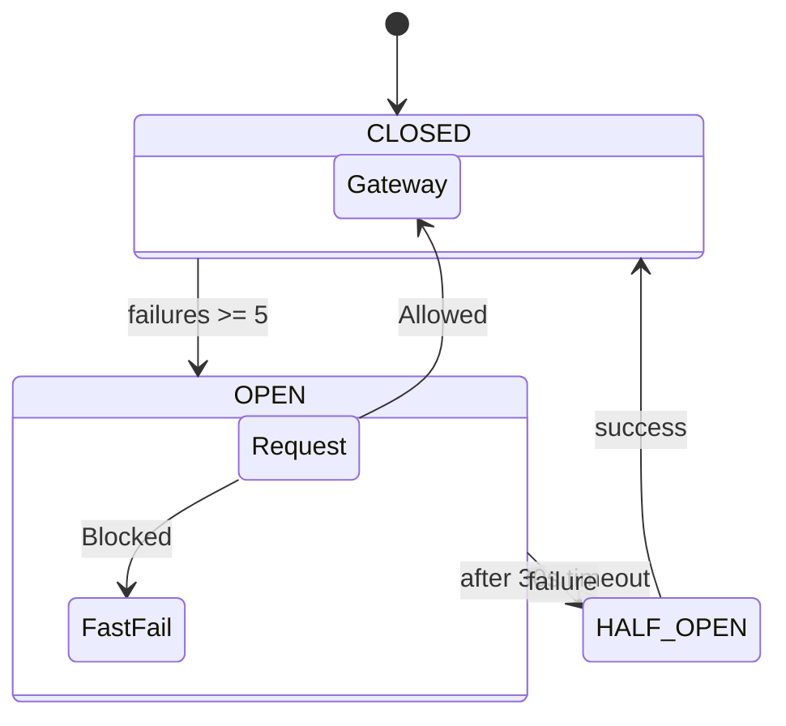
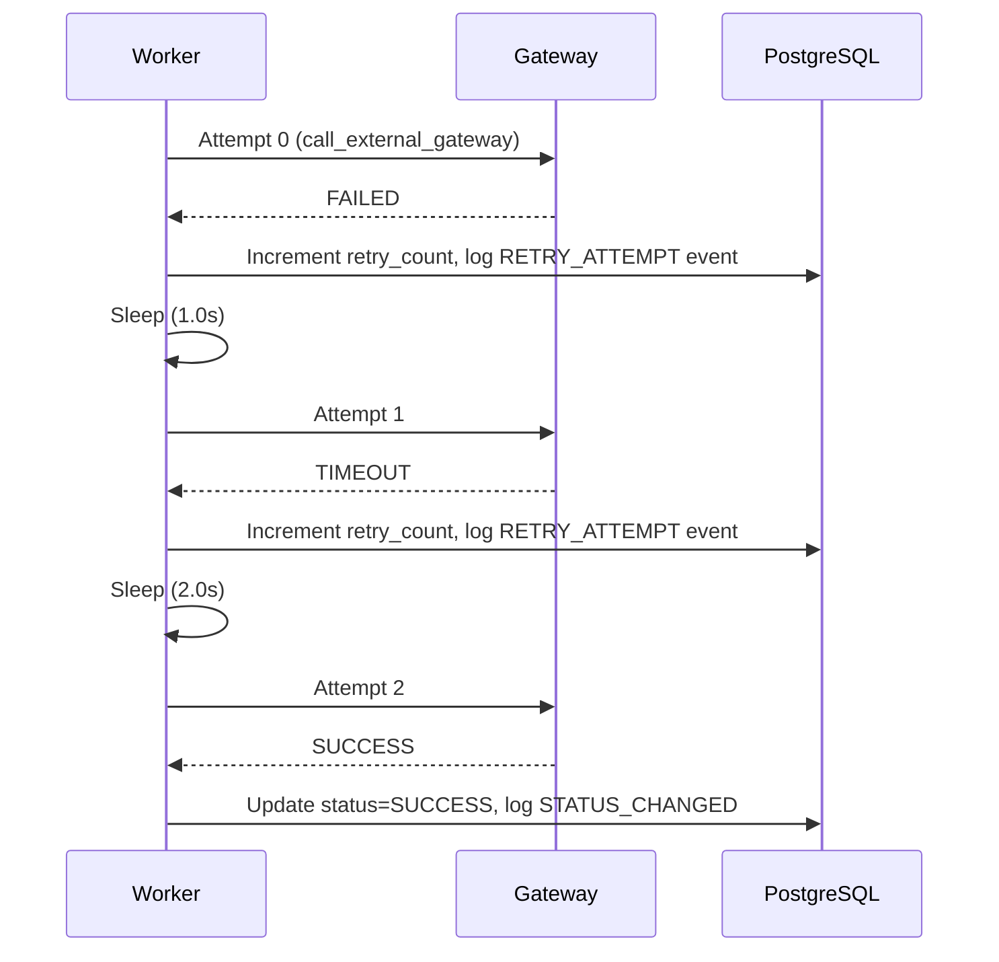

# Payment Service POC — Architecture Document

> **Scope**: Complete architecture document generated from full repository analysis.
> **Depth**: Implementation-level deep analysis — all components fully documented.
> **Architecture Style**: Modular Monolith (single deployable service)

---

## Executive Summary

The `payment-service-poc` is a **Python-based modular monolith** that simulates a real-world payment processing system. It is built on **FastAPI** (async ASGI) with **SQLAlchemy 2.0** (async ORM), **Celery** (distributed task queue), **PostgreSQL 17** (primary datastore), and **Redis 7** (message broker + result backend). The service exposes a versioned REST API (`/api/v1/`) for payment lifecycle operations and implements production-grade resilience patterns including a **circuit breaker**, **exponential backoff retry**, **idempotency enforcement**, **rate limiting**, and a full **payment event audit trail**.

| Attribute | Value |
|---|---|
| **Language** | Python 3.12+ |
| **Framework** | FastAPI 0.115.0 |
| **ORM** | SQLAlchemy 2.0.36 (async) |
| **Database** | PostgreSQL 17 (via `asyncpg`) |
| **Task Queue** | Celery 5.4.0 |
| **Broker/Backend** | Redis 7 (via `redis 5.0.8`) |
| **Migrations** | Alembic 1.13.3 |
| **Validation** | Pydantic 2.9.2 |
| **CLI** | Typer 0.15.2 |
| **Test Framework** | pytest 8.3.3 + pytest-asyncio 0.24.0 |
| **HTTP Client (tests)** | httpx 0.27.2 |
| **Containerization** | Docker Compose 3.8 |

---

## High-Level Architecture

```
┌─────────────────────────────────────────────────────────────────┐
│                     PAYMENT SERVICE (Monolith)                  │
│                                                                 │
│  ┌──────────┐    ┌──────────────┐    ┌───────────────────────┐  │
│  │  FastAPI  │───▶│  Routers     │───▶│  Payment Module       │  │
│  │  (ASGI)  │    │  /api/v1/    │    │  ┌─────────────────┐  │  │
│  │          │    │              │    │  │ Controller      │  │  │
│  │          │    └──────────────┘    │  │ Service         │  │  │
│  │          │                        │  │ Repository      │  │  │
│  └──────────┘                        │  │ Schema/Parser   │  │  │
│       │                              │  └─────────────────┘  │  │
│       │                              └───────────────────────┘  │
│       │                                         │               │
│  ┌────▼─────────────┐                ┌──────────▼────────────┐  │
│  │  Middleware Layer │                │  Common Layer         │  │
│  │  • Client Auth   │                │  • BaseOperations     │  │
│  │  • Rate Limiter  │                │  • Models / Mixins    │  │
│  │  • CORS          │                │  • Exceptions         │  │
│  └──────────────────┘                │  • Config / Logger    │  │
│                                      └───────────────────────┘  │
│       │                                         │               │
│  ┌────▼─────────────┐                ┌──────────▼────────────┐  │
│  │  Gateway Layer   │                │  Celery Worker        │  │
│  │  • Simulator     │◄──────────────▶│  • payment_tasks      │  │
│  │  • CircuitBreaker│                │  • PaymentProcessor   │  │
│  └──────────────────┘                └───────────────────────┘  │
│                                              │      │           │
└──────────────────────────────────────────────┼──────┼───────────┘
                                               │      │
                                    ┌──────────▼┐  ┌──▼──────────┐
                                    │ PostgreSQL │  │    Redis    │
                                    │  17-alpine │  │  7-alpine   │
                                    │  Port 5435 │  │  Port 6382  │
                                    └────────────┘  └─────────────┘
```

---

## Infrastructure Overview

Infrastructure is defined in [docker-compose.yml](file:///d:/projects/XP/payment-service-poc/docker-compose.yml) (Docker Compose v3.8):

| Service | Image | Container Name | External Port | Internal Port | Persistent Volume |
|---|---|---|---|---|---|
| **PostgreSQL** | `postgres:17-alpine` | `payment_postgres` | `5435` | `5432` | `postgres_data` |
| **Redis** | `redis:7-alpine` | `payment_redis` | `6382` | `6379` | `redis_data` |

> [!NOTE]
> The FastAPI application and Celery worker run **outside Docker** (host machine). Only PostgreSQL and Redis are containerized. There is **no Dockerfile** for the application itself.

**Application Entry Points** (via [manage.py](file:///d:/projects/XP/payment-service-poc/manage.py) CLI — Typer):

| Command | Purpose |
|---|---|
| `python manage.py run` | Start FastAPI via Uvicorn (`0.0.0.0:8000`, hot-reload) |
| `python manage.py run_worker` | Start Celery worker (`-P solo`, info loglevel) |
| `python manage.py migrate-dev` | Run Alembic migrations (`upgrade head`) |
| `python manage.py makemigrations-dev` | Autogenerate new Alembic revision |
| `python manage.py downgrade-dev` | Downgrade Alembic migration (default: `-1`) |
| `python manage.py history` | Show Alembic migration history |
| `python manage.py current` | Show current Alembic revision |

---

## Database Architecture

**Engine**: PostgreSQL 17 via `asyncpg` driver | **ORM**: SQLAlchemy 2.0 (async mode)
**Connection pool**: Calculated as `max(5, (100 - 5) // 4)` = **23** connections per process, with `max_overflow=10`.
**Session management**: Auto-commit on success, auto-rollback on exception (via [database.py](file:///d:/projects/XP/payment-service-poc/common/database.py) `get_async_session` generator).

### Tables (2)



### Indexes

| Table | Index | Columns | Unique |
|---|---|---|---|
| `payments` | `ix_payments_payment_num` | `payment_num` | ✅ |
| `payments` | `ix_payments_idempotency_key` | `idempotency_key` | ✅ |
| `payment_events` | `ix_payment_events_payment_id` | `payment_id` | ❌ |

### Audit Columns (CommonFieldMixin)

Both tables inherit from [CommonFieldMixin](file:///d:/projects/XP/payment-service-poc/common/models/mixins.py) providing: `created_at`, `updated_at`, `created_by`, `updated_by`, `is_deleted` (soft-delete flag), `modified_by`.

---

## Redis Architecture

Redis serves a **dual purpose** in this system — both roles use the **same Redis instance**:

| Role | Usage | Configuration |
|---|---|---|
| **Celery Broker** | Message transport for task dispatch | `REDIS_URL` (default: `redis://localhost:6382/0`) |
| **Celery Result Backend** | Stores task results and state | Same `REDIS_URL` |

> [!NOTE]
> Redis is **not** used for application-level caching, session storage, or distributed rate limiting. The rate limiter uses an **in-memory** sliding window (`defaultdict(deque)`), not Redis.

---

## Celery Architecture

Defined in [celery_app.py](file:///d:/projects/XP/payment-service-poc/celery_app.py):

| Setting | Value | Purpose |
|---|---|---|
| **App Name** | `payment_service` | Celery application identifier |
| **Serializer** | `json` (task + result) | Message format |
| **Timezone** | `UTC` | Task scheduling timezone |
| **task_acks_late** | `True` | Acknowledge only after task completes (at-least-once delivery) |
| **task_reject_on_worker_lost** | `True` | Re-queue task if worker crashes |
| **Worker Pool** | `-P solo` (single-threaded) | Suitable for async tasks |
| **Task Autodiscovery** | `common.tasks.payment_tasks` | Explicit include |

### Registered Tasks

| Task | Function | Trigger |
|---|---|---|
| `process_payment_task` | [payment_tasks.py](file:///d:/projects/XP/payment-service-poc/common/tasks/payment_tasks.py#L155-L158) | Dispatched by `PaymentService.create_payment()` and `retry_payment()` |

---

## Payment Processing Architecture

### State Machine



### Payment Lifecycle Flow



### Resilience Patterns

| Pattern | Implementation | Configuration |
|---|---|---|
| **Circuit Breaker** | [circuit_breaker.py](file:///d:/projects/XP/payment-service-poc/common/gateway/circuit_breaker.py) — 3-state (CLOSED → OPEN → HALF_OPEN) with async lock | `CB_FAILURE_THRESHOLD=5`, `CB_RECOVERY_TIMEOUT=30s` |
| **Exponential Backoff** | `min(BASE_DELAY × 2^attempt, MAX_DELAY)` | `RETRY_BASE_DELAY=1.0s`, `RETRY_MAX_DELAY=30.0s` |
| **Idempotency** | Unique `idempotency_key` column + check before insert | N/A |
| **Pessimistic Locking** | `SELECT ... FOR UPDATE SKIP LOCKED` | Prevents concurrent processing of same payment |
| **At-Least-Once Delivery** | `task_acks_late=True` + `task_reject_on_worker_lost=True` | Celery config |

### Gateway Simulator

The [simulator.py](file:///d:/projects/XP/payment-service-poc/common/gateway/simulator.py) simulates an external payment gateway with **probabilistic outcomes**:

| Outcome | Probability (default) |
|---|---|
| **TIMEOUT** | 10% (`GATEWAY_TIMEOUT_RATE`) |
| **SUCCESS** | 65% (`GATEWAY_SUCCESS_RATE`) |
| **FAILED** | 25% (remainder) |

Simulated latency: `uniform(0.2s, 1.5s)` + additional `5.0s` on timeout.

---

## Security Architecture

| Layer | Mechanism | Implementation |
|---|---|---|
| **Authentication** | Static API Key via `X-Client-Key` header | [client_auth.py](file:///d:/projects/XP/payment-service-poc/common/middlewares/client_auth.py) — `APIKeyHeader` security scheme |
| **Rate Limiting** | In-memory sliding window per client IP | [rate_limiter.py](file:///d:/projects/XP/payment-service-poc/common/middlewares/rate_limiter.py) — `10 requests / 60s` default |
| **CORS** | Permissive (`allow_origins=["*"]`) | [main.py](file:///d:/projects/XP/payment-service-poc/main.py#L14-L20) — `CORSMiddleware` |
| **Endpoint Protection** | Auth + Rate Limit on write endpoints; Auth-only on reads; None on webhook + circuit-status | Per-route `dependencies=[...]` in controller |

### Endpoint Authentication Matrix

| Endpoint | Auth Required | Rate Limited |
|---|---|---|
| `POST /api/v1/payments/` | ✅ | ✅ |
| `GET /api/v1/payments/` | ✅ | ❌ |
| `GET /api/v1/payments/{id}` | ✅ | ❌ |
| `GET /api/v1/payments/num/{payment_num}` | ✅ | ❌ |
| `GET /api/v1/payments/{id}/events` | ✅ | ❌ |
| `POST /api/v1/payments/{id}/retry` | ✅ | ✅ |
| `POST /api/v1/payments/webhook/callback` | ❌ | ❌ |
| `GET /api/v1/payments/gateway/circuit-status` | ❌ | ❌ |

---

## Components

### API Layer

**Purpose**: The API layer is the outermost boundary of the service. It bootstraps the FastAPI application, registers global middleware (CORS), mounts versioned routers, and exposes auto-generated OpenAPI documentation. It acts as the composition root that wires all modules into a single deployable HTTP surface.

**Files**: [main.py](file:///d:/projects/XP/payment-service-poc/main.py), [routers/\_\_init\_\_.py](file:///d:/projects/XP/payment-service-poc/routers/__init__.py)

**Folder Structure**:
```
├── main.py                  # FastAPI app factory + CORS middleware
└── routers/
    └── __init__.py           # Central router aggregator
```

**Request Flow**:
1. `main.py` creates a `FastAPI` instance configured with service name, description, and version from `settings`.
2. `CORSMiddleware` is attached globally with permissive `allow_origins=["*"]`, `allow_credentials=False`, explicitly allowing `x-client-key` / `X-Client-Key` headers.
3. The single `api_router` from `routers/__init__.py` is mounted under the `/api/v1` prefix.
4. Inside `routers/__init__.py`, a bare `APIRouter()` includes `payment_routers` from the payment controller — no additional prefix is added at this level.
5. The final URL composition is: `app(/api/v1) → api_router() → payment_routers(/payments) → endpoints`.

**Business Logic**:
- The API layer contains **zero business logic**. It is purely a composition layer.
- `main.py` (23 lines) does three things: create app, add CORS, mount router.
- `routers/__init__.py` (6 lines) does one thing: aggregate module routers into a single `api_router`.

**Design Decisions**:
- **Versioned prefix (`/api/v1`)**: Applied at the `app.include_router()` level in `main.py`, not inside individual modules. This means the version prefix is managed centrally — changing to `/api/v2` requires editing only `main.py`.
- **Router aggregation pattern**: The `routers/__init__.py` acts as a registry. New modules (e.g., `refund`, `settlement`) would add a single `api_router.include_router(refund_routers)` line here.
- **OpenAPI docs enabled**: Both `/docs` (Swagger UI) and `/redoc` (ReDoc) are explicitly enabled.
- **CORS `allow_credentials=False`**: Correctly paired with `allow_origins=["*"]` — if both were `True`, browsers would reject the response per the CORS spec.

**Error Handling**: No custom error handling at this layer. FastAPI's default exception handlers convert `HTTPException` subclasses into JSON error responses automatically.

**Security Considerations**:
- CORS is fully permissive (`*`) — acceptable for a POC but would need origin whitelisting in production.
- The `X-Client-Key` header is explicitly listed in `allow_headers` to ensure browsers include it in preflight CORS requests.

**Scalability Considerations**:
- Uvicorn runs with `--reload` (dev mode). Production would use `gunicorn` with multiple Uvicorn workers.
- The app factory pattern allows easy extension — new modules simply register routers.

---

### Payment Module

**Purpose**: The payment module is the core business domain of the service. It encapsulates the entire payment lifecycle — creation, processing, retry, webhook reconciliation, and audit trail — within a self-contained `module/payment/` directory. It follows a **Controller → Service → Repository** layered architecture internally.

**Files**:
- [payment_controller.py](file:///d:/projects/XP/payment-service-poc/module/payment/payment_controller.py) — 8 endpoints, `APIRouter(prefix="/payments")`
- [payment_service.py](file:///d:/projects/XP/payment-service-poc/module/payment/payment_service.py) — Business logic (create, get, search, retry, webhook)
- [payment_repository.py](file:///d:/projects/XP/payment-service-poc/module/payment/payment_repository.py) — Data access (idempotency check, lock, events, search)
- [payment_schema.py](file:///d:/projects/XP/payment-service-poc/module/payment/payment_schema.py) — Pydantic models (4 statuses, request/response schemas)
- [payment_parser.py](file:///d:/projects/XP/payment-service-poc/module/payment/payment_parser.py) — DTO-to-dict mapper

**Folder Structure**:
```
module/payment/
├── __init__.py
├── payment_controller.py    # HTTP layer (routes, dependencies, status codes)
├── payment_service.py       # Business orchestration (idempotency, task dispatch)
├── payment_repository.py    # Data access (queries, locking, events)
├── payment_schema.py        # Pydantic DTOs (request/response validation)
└── payment_parser.py        # Schema-to-dict transformer
```

**Request Flow**:
```
HTTP Request → Controller → Service → Repository → Database
                  │              │           │
                  │              │           └── BaseOperations (CRUD)
                  │              └── Parser (DTO → dict)
                  └── Middleware (Auth, Rate Limit) via Depends()
```

**Controller Layer** ([payment_controller.py](file:///d:/projects/XP/payment-service-poc/module/payment/payment_controller.py)):
- Defines 8 endpoints on `APIRouter(prefix="/payments")`.
- Uses FastAPI's `Depends()` for dependency injection of `PaymentService`, `get_api_client`, and `rate_limit_check`.
- The controller is **thin** — every handler is a single-line delegation to the service layer.
- Write endpoints (`POST /`, `POST /{id}/retry`) apply both auth and rate limiting.
- Read endpoints (`GET /`, `GET /{id}`, `GET /num/{payment_num}`, `GET /{id}/events`) apply auth only.
- Two endpoints are fully unauthenticated: `POST /webhook/callback` and `GET /gateway/circuit-status`.
- `create_payment` returns `HTTP 202 Accepted` (not 201) because processing is asynchronous.

**Service Layer** ([payment_service.py](file:///d:/projects/XP/payment-service-poc/module/payment/payment_service.py)):
- `PaymentService` receives `PaymentRepository` via `Depends()` — FastAPI auto-resolves the full dependency chain (repository → session → engine).
- **`create_payment()`**: Checks idempotency → generates `PAY-{timestamp}-{random}` number → persists via `BaseOperations.create()` → logs `INITIATED` event → dispatches `process_payment_task.delay(id)` to Celery.
- **`retry_payment()`**: Validates payment isn't already `SUCCESS` → logs `RETRY_REQUESTED` event → re-dispatches to Celery.
- **`handle_webhook()`**: Looks up payment by `gateway_ref` → handles three scenarios: (1) duplicate webhook (same status, return as-is), (2) conflicting webhook (stored status wins, log `WEBHOOK_CONFLICT` event), (3) valid update (apply new status, log `STATUS_CHANGED` event).
- **Lazy import pattern**: `from common.tasks.payment_tasks import process_payment_task` is imported inside method bodies to avoid circular imports between the service and task modules.

**Schema Layer** ([payment_schema.py](file:///d:/projects/XP/payment-service-poc/module/payment/payment_schema.py)):
- `PaymentStatus(StrEnum)`: 4 states — `PENDING`, `PROCESSING`, `SUCCESS`, `FAILED`.
- `PaymentCreateRequest`: Validates `amount > 0` via `Field(gt=0)`, uses `Decimal` for financial precision.
- `PaymentResponse`: Includes `already_processed: Optional[bool] = False` — a transient flag set dynamically for idempotency hits (not persisted to DB).
- `WebhookCallbackRequest`: Includes `signature: Optional[str]` — placeholder for future HMAC verification.
- All schemas inherit from `BaseRequestModel` / `BaseResponseModel` with `ConfigDict(from_attributes=True)` enabling direct ORM model → Pydantic serialization.

**Parser Layer** ([payment_parser.py](file:///d:/projects/XP/payment-service-poc/module/payment/payment_parser.py)):
- Single function `to_payment_dict()` that maps a `PaymentCreateRequest` + generated `payment_num` into a flat `Dict[str, Any]` for `BaseOperations.create()`.
- Hardcodes `status=PENDING` and `retry_count=0` regardless of input.

**Database Interactions**:
- All writes use `BaseOperations.create()` and `BaseOperations.update()` with `flush() → refresh()` for immediate ID generation.
- Idempotency check: `SELECT ... WHERE idempotency_key = ? AND is_deleted = false`.
- Search: Dynamic `WHERE` clause construction — each filter is conditionally appended.

**Design Decisions**:
- **Modular monolith boundary**: The `module/payment/` directory is a self-contained vertical slice. A second module (e.g., `module/refund/`) would follow the same structure.
- **Async-first**: Every method is `async def`, enabling non-blocking I/O throughout.
- **Fire-and-forget dispatch**: `create_payment()` returns `202 Accepted` immediately after enqueueing — the client must poll or receive a webhook for final status.
- **Idempotency at service level**: Checked before insert, not via DB constraint catch. The `IDEMPOTENCY_HIT` event provides audit visibility.

**Error Handling**:
- `NotFoundException` (404) for missing payments.
- `BadRequestException` (400) for retrying successful payments.
- Pydantic `ValidationError` (422) for invalid input (negative amounts, missing fields).

**Security Considerations**:
- Webhook endpoint is unauthenticated — in production, HMAC signature verification (`signature` field) would be required.
- No authorization model — any valid API key can access any payment.

**Scalability Considerations**:
- Search endpoint has no pagination — will degrade with large datasets.
- No caching on read endpoints — every request hits the database.

---

### Repository Layer

**Purpose**: The repository layer provides a **generic, reusable data access abstraction** over SQLAlchemy async sessions. `BaseOperations` is a model-agnostic CRUD class that any module can compose with (not inherit from). The payment module's `PaymentRepository` wraps `BaseOperations` for both `Payment` and `PaymentEvent` models, adding domain-specific queries like `lock_for_update()` and `search()`.

**Files**: [base_operations.py](file:///d:/projects/XP/payment-service-poc/common/repositories/base_operations.py), [payment_repository.py](file:///d:/projects/XP/payment-service-poc/module/payment/payment_repository.py)

**Folder Structure**:
```
common/repositories/
└── base_operations.py       # Generic CRUD (model-agnostic)
module/payment/
└── payment_repository.py    # Domain-specific data access
```

**BaseOperations API** ([base_operations.py](file:///d:/projects/XP/payment-service-poc/common/repositories/base_operations.py)):

| Method | Signature | Behavior |
|---|---|---|
| `create()` | `(data: Dict) → T` | Instantiate model, `session.add()`, `flush()`, `refresh()`, return with populated ID |
| `update()` | `(obj: T, data: Dict) → T` | `setattr()` loop, `session.add()`, `flush()`, `refresh()` |
| `faf_one_by_id()` | `(obj_id: int) → T` | `SELECT WHERE id = ? AND is_deleted = false` — raises `NotFoundException` if missing |
| `get_by_field()` | `(field_name: str, value) → Optional[T]` | Dynamic field lookup with `hasattr()` validation — returns `None` if not found |
| `get_all_by_field()` | `(field_name: str, value) → List[T]` | Same as `get_by_field` but returns all matches |
| `soft_delete()` | `(obj: T) → T` | Sets `is_deleted=True` via `update()` — no hard deletes |

**PaymentRepository** ([payment_repository.py](file:///d:/projects/XP/payment-service-poc/module/payment/payment_repository.py)):

| Method | Purpose |
|---|---|
| `get_by_idempotency_key()` | Delegates to `bo.get_by_field("idempotency_key", ...)` |
| `lock_for_update()` | `SELECT ... FOR UPDATE SKIP LOCKED` — pessimistic lock for concurrent worker safety |
| `create_event()` | Convenience wrapper around `event_bo.create()` for audit trail entries |
| `get_events()` | `SELECT ... WHERE payment_id = ? ORDER BY created_at ASC` — chronological event history |
| `search()` | Dynamic multi-filter query builder (status, payment_num, payer_email, currency) |

**Request Flow**:
```
Service.create_payment()
  → repo.get_by_idempotency_key()     # Check duplicate
  → repo.bo.create(payment_dict)       # INSERT payment
  → repo.create_event(...)             # INSERT event

PaymentProcessor.process()
  → repo.lock_for_update(id)           # SELECT FOR UPDATE SKIP LOCKED
  → repo.bo.update(payment, {...})     # UPDATE status
  → repo.create_event(...)             # INSERT event
```

**Database Interactions**:
- **Flush vs Commit**: `BaseOperations` uses `flush()` (not `commit()`) to write to the DB within the current transaction. The actual `commit()` happens in `get_async_session()` context manager (for API requests) or explicitly in `PaymentProcessor` (for Celery tasks).
- **Refresh after flush**: Every create/update calls `refresh()` to reload server-generated values (auto-increment IDs, `func.now()` timestamps).
- **Composition pattern**: `PaymentRepository` holds `self.bo = BaseOperations(session, Payment)` and `self.event_bo = BaseOperations(session, PaymentEvent)` — two instances of the same class for two different models.

**Design Decisions**:
- **Composition over inheritance**: `PaymentRepository` does not subclass `BaseOperations`. It composes two instances (`bo`, `event_bo`). This avoids the diamond inheritance problem and allows multi-model repositories.
- **Dynamic field lookup**: `get_by_field()` uses `getattr(self.model_class, field_name)` with `hasattr()` validation — enabling reuse but trading type safety for flexibility.
- **Soft delete everywhere**: Every query includes `WHERE is_deleted = false`. Records are never physically deleted — `soft_delete()` flips the flag.
- **`faf_one_by_id` naming**: "Find-and-Fail" — explicitly communicates that this method raises on miss, unlike `get_by_field` which returns `None`.

**Error Handling**:
- `create()` / `update()`: Catches `Exception`, calls `session.rollback()`, raises `InternalServerError(500)`.
- `faf_one_by_id()`: Raises `NotFoundException(404)` when record is missing.
- `get_by_field()`: Raises `BadRequestException(400)` if the field name doesn't exist on the model.

**Security Considerations**:
- `get_by_field()` allows arbitrary field lookups — in production, a whitelist of queryable fields would prevent information disclosure.

**Scalability Considerations**:
- `get_all_by_field()` loads all matching rows into memory — no pagination or limit.
- The `search()` method builds queries dynamically but doesn't add `LIMIT` / `OFFSET`.
- `lock_for_update(skip_locked=True)` is specifically designed for multi-worker scalability — workers that can't acquire the lock skip the row instead of blocking.

---

### Database Models

**Purpose**: The database models define the SQLAlchemy ORM mapping for all persistent entities. The architecture uses a shared `Base` declarative class, a `CommonFieldMixin` for cross-cutting audit columns, and domain-specific models (`Payment`, `PaymentEvent`) that inherit from both.

**Files**:
- [base.py](file:///d:/projects/XP/payment-service-poc/common/models/base.py) — `declarative_base()`
- [mixins.py](file:///d:/projects/XP/payment-service-poc/common/models/mixins.py) — `CommonFieldMixin` (6 audit columns)
- [payment.py](file:///d:/projects/XP/payment-service-poc/common/models/payment.py) — `Payment` (22 columns), `PaymentEvent` (10 columns)

**Folder Structure**:
```
common/models/
├── base.py       # SQLAlchemy declarative base (shared by all models)
├── mixins.py     # Reusable audit column mixin
└── payment.py    # Payment + PaymentEvent ORM models
```

**Model Hierarchy**:
```
declarative_base() ← Base
                        ↑
        Payment(Base, CommonFieldMixin)
        PaymentEvent(Base, CommonFieldMixin)
```

**CommonFieldMixin** ([mixins.py](file:///d:/projects/XP/payment-service-poc/common/models/mixins.py)) — 6 audit columns injected via `@declared_attr`:

| Column | Type | Default | Purpose |
|---|---|---|---|
| `created_at` | `DateTime` | `func.now()` (DB-side) | Record creation timestamp |
| `updated_at` | `DateTime` | `func.now()`, `onupdate=func.now()` | Last modification timestamp |
| `created_by` | `BigInteger` | `1` | User ID of creator (hardcoded in POC) |
| `updated_by` | `BigInteger` | `1` | User ID of last updater (hardcoded in POC) |
| `is_deleted` | `Boolean` | `False` | Soft-delete flag |
| `modified_by` | `String(32)` | `None` | Service/system identifier for modification source |

**Payment Model** ([payment.py](file:///d:/projects/XP/payment-service-poc/common/models/payment.py)) — 16 domain columns + 6 mixin columns:

| Column | Type | Constraints | Purpose |
|---|---|---|---|
| `id` | `BigInteger` | PK, auto-increment | Primary key |
| `payment_num` | `String(64)` | Unique, Not Null, Indexed | Human-readable payment identifier (`PAY-{ts}-{rand}`) |
| `idempotency_key` | `String(128)` | Unique, Not Null, Indexed | Client-provided deduplication key |
| `amount` | `Numeric(12,2)` | Not Null | Payment amount with 2 decimal precision |
| `currency` | `String(8)` | Default `INR` | ISO currency code |
| `status` | `String(32)` | Default `PENDING` | Current state: PENDING/PROCESSING/SUCCESS/FAILED |
| `gateway_ref` | `String(128)` | Nullable | External gateway reference ID |
| `gateway_status` | `String(32)` | Nullable | Gateway-reported status |
| `failure_reason` | `Text` | Nullable | Last failure/retry reason |
| `retry_count` | `Integer` | Default `0` | Current retry attempt count |
| `max_retries` | `Integer` | Default `3` | Maximum allowed retries |
| `payer_name` | `String(128)` | Nullable | Payer's full name |
| `payer_email` | `String(128)` | Nullable | Payer's email address |
| `payer_phone` | `String(32)` | Nullable | Payer's phone number |
| `description` | `Text` | Nullable | Payment description/narration |
| `metadata_json` | `Text` | Nullable | Arbitrary JSON metadata (stored as text) |
| `webhook_received_at` | `DateTime` | Nullable | Timestamp when webhook was received |
| `processed_at` | `DateTime` | Nullable | Timestamp of final processing (success or failure) |

**PaymentEvent Model** — 4 domain columns + 6 mixin columns:

| Column | Type | Constraints | Purpose |
|---|---|---|---|
| `id` | `BigInteger` | PK, auto-increment | Primary key |
| `payment_id` | `BigInteger` | FK → `payments.id`, Indexed | Parent payment reference |
| `event_type` | `String(64)` | Not Null | Event classifier (see table below) |
| `from_status` | `String(32)` | Nullable | Previous status (for transitions) |
| `to_status` | `String(32)` | Nullable | New status (for transitions) |
| `gateway_ref` | `String(128)` | Nullable | Gateway reference at time of event |
| `notes` | `Text` | Nullable | Human-readable event description |

**Event Types** (used across the system):

| Event Type | When Created | Location |
|---|---|---|
| `INITIATED` | Payment created | `PaymentService.create_payment()` |
| `IDEMPOTENCY_HIT` | Duplicate idempotency key | `PaymentService.create_payment()` |
| `STATUS_CHANGED` | Any status transition | `PaymentProcessor` + `PaymentService.handle_webhook()` |
| `RETRY_ATTEMPT` | Each retry iteration | `PaymentProcessor._handle_retry()` |
| `RETRY_REQUESTED` | Manual retry API call | `PaymentService.retry_payment()` |
| `WEBHOOK_CONFLICT` | Conflicting webhook received | `PaymentService.handle_webhook()` |

**Design Decisions**:
- **No SQLAlchemy `relationship()`**: The `Payment` → `PaymentEvent` foreign key exists at the DB level but no ORM relationship is defined. Events are loaded via explicit queries in `PaymentRepository.get_events()`. This avoids lazy-loading pitfalls in async contexts.
- **`metadata_json` as `Text`**: Stored as raw JSON string, not `JSONB`. Simpler but loses PostgreSQL JSON query capabilities.
- **`Numeric(12, 2)` for amounts**: Supports values up to 9,999,999,999.99 with exact decimal precision (no floating-point errors).
- **`@declared_attr` in mixin**: Required for SQLAlchemy mixins with multiple inheritance — ensures each subclass gets its own column descriptor.

**Error Handling**: Models themselves don't raise exceptions. Error handling is in `BaseOperations` which wraps all DB operations.

**Security Considerations**:
- `created_by` / `updated_by` are hardcoded to `1` — no real user identity tracking.
- `payer_email` and `payer_phone` are stored in plaintext — would need encryption at rest in production.

**Scalability Considerations**:
- `BigInteger` primary keys support very large datasets.
- `payment_events` can grow unboundedly (append-only audit trail) — would need partitioning or archival strategy at scale.

---

### Gateway Layer

**Purpose**: The gateway layer simulates integration with an external payment processor (e.g., Stripe, Razorpay) and implements a circuit breaker pattern to protect the system from cascading failures when the external gateway is degraded. In production, the simulator would be replaced with actual HTTP calls to a real gateway API.

**Files**:
- [simulator.py](file:///d:/projects/XP/payment-service-poc/common/gateway/simulator.py) — `call_external_gateway()` with probabilistic outcomes
- [circuit_breaker.py](file:///d:/projects/XP/payment-service-poc/common/gateway/circuit_breaker.py) — `CircuitBreaker` class, singleton `gateway_circuit_breaker`

**Folder Structure**:
```
common/gateway/
├── simulator.py         # Simulated external payment gateway
└── circuit_breaker.py   # Circuit breaker state machine
```

**Gateway Simulator** ([simulator.py](file:///d:/projects/XP/payment-service-poc/common/gateway/simulator.py)):

`call_external_gateway()` is an `async` function that simulates real-world gateway behavior:
1. **Latency simulation**: `await asyncio.sleep(uniform(DELAY_MIN, DELAY_MAX))` — random delay between 0.2s–1.5s.
2. **Outcome determination**: A single `random.random()` value determines the outcome:
   - `rand < 0.10` → **TIMEOUT**: Additional 5.0s sleep, then return `GatewayOutcome.TIMEOUT`.
   - `rand < 0.10 + 0.65` → **SUCCESS**: Generate `GW-{8-char-hex}` reference, return `GatewayOutcome.SUCCESS`.
   - `rand >= 0.75` → **FAILED**: Return `GatewayOutcome.FAILED` with decline message.
3. **`GatewayResponse` dataclass**: Returns `outcome` (enum), `gateway_ref` (str|None), `message` (str).

**Circuit Breaker** ([circuit_breaker.py](file:///d:/projects/XP/payment-service-poc/common/gateway/circuit_breaker.py)):

Implements the classic 3-state circuit breaker pattern with an `asyncio.Lock` for thread safety:

```
    ┌──────────┐  failure_count >= 5   ┌──────────┐
    │  CLOSED  │ ─────────────────────▶│   OPEN   │
    │          │                       │          │
    │          │◀──────────────────────│          │
    └──────────┘   success in          └──────────┘
         ▲         HALF_OPEN                │
         │                                  │ recovery_timeout
         │         ┌──────────┐             │   (30s elapsed)
         └─────────│HALF_OPEN │◀────────────┘
           success └──────────┘
                        │ failure
                        └──────────▶ OPEN
```

| Method | Behavior |
|---|---|
| `record_failure()` | Increments `failure_count`. If CLOSED and count ≥ threshold (5): transition to OPEN. If HALF_OPEN: transition back to OPEN. |
| `record_success()` | If OPEN or HALF_OPEN: transition to CLOSED, reset `failure_count=0`. If CLOSED: just reset `failure_count=0`. |
| `check_state()` | If OPEN and `time.time() - last_failure_time ≥ recovery_timeout` (30s): transition to HALF_OPEN. Returns current state. |

**State Attributes**:
- `state: CircuitState` — Current circuit state (enum: CLOSED/OPEN/HALF_OPEN)
- `failure_count: int` — Rolling failure counter (reset on any success)
- `last_failure_time: float` — Unix timestamp of last OPEN transition
- `_lock: asyncio.Lock` — Prevents race conditions in concurrent async contexts

**Singleton**: `gateway_circuit_breaker = CircuitBreaker()` — module-level instance shared across all requests within the same process.

**Request Flow**:
```
PaymentProcessor._execute_retries()
  → gateway_circuit_breaker.check_state()      # Pre-flight check
  → call_external_gateway()                     # Attempt payment
  → gateway_circuit_breaker.record_success()    # On SUCCESS
  → gateway_circuit_breaker.record_failure()    # On FAILED/TIMEOUT/Exception
```

**Design Decisions**:
- **In-process state**: The circuit breaker state lives in memory — not shared across multiple Uvicorn workers or Celery workers. Each process maintains its own circuit breaker independently.
- **`asyncio.Lock`**: Protects state transitions from race conditions when multiple coroutines call `record_failure()` / `record_success()` concurrently within the same event loop.
- **SKIP_LOCKED integration**: The circuit breaker works in tandem with `SELECT FOR UPDATE SKIP LOCKED` — if the circuit is OPEN, the payment immediately fails without attempting the gateway.

**Error Handling**: The circuit breaker itself doesn't raise exceptions. `CircuitOpenException(503)` is defined in the exception hierarchy but is not currently raised — instead, `PaymentProcessor._is_circuit_breaker_open()` marks the payment as FAILED directly.

**Security Considerations**: The simulator uses `random.random()` (not cryptographically secure) — acceptable for simulation but real gateway refs should use proper ID generation.

**Scalability Considerations**:
- In-process circuit breaker means each worker independently tracks gateway health. A distributed circuit breaker (via Redis) would provide system-wide protection.
- The singleton pattern is appropriate for single-process workers (`-P solo`).

---

### Middleware Layer

**Purpose**: The middleware layer provides cross-cutting request-level concerns — authentication and rate limiting — implemented as FastAPI dependencies (not ASGI middleware). These are applied selectively per-endpoint via `dependencies=[Depends(...)]` on route decorators, giving fine-grained control over which endpoints are protected.

**Files**:
- [client_auth.py](file:///d:/projects/XP/payment-service-poc/common/middlewares/client_auth.py) — `get_api_client()` dependency (API key validation)
- [rate_limiter.py](file:///d:/projects/XP/payment-service-poc/common/middlewares/rate_limiter.py) — `rate_limit_check()` dependency (sliding window)

**Folder Structure**:
```
common/middlewares/
├── client_auth.py    # API key authentication
└── rate_limiter.py   # Sliding window rate limiter
```

**Client Authentication** ([client_auth.py](file:///d:/projects/XP/payment-service-poc/common/middlewares/client_auth.py)):

`get_api_client(request, api_key)` — an async dependency that validates the `X-Client-Key` header:

1. **Header extraction** (triple fallback):
   - Primary: FastAPI's `Security(APIKeyHeader(name="X-Client-Key", auto_error=False))`.
   - Fallback 1: `request.headers.get("x-client-key")` (lowercase).
   - Fallback 2: `request.headers.get("X-Client-Key")` (original case).
2. **Sanitization**: Both incoming and expected values are stripped of whitespace, double quotes, and single quotes — defensive against `.env` parsing quirks.
3. **Comparison**: Direct string equality check.
4. **On failure**: Raises `HTTPException(401, "Invalid or missing X-Client-Key header")`.
5. **On success**: Returns the cleaned key string.

**Implementation Details**:
- `auto_error=False` on `APIKeyHeader` prevents FastAPI from auto-raising 403 when the header is missing — allows the custom triple-fallback logic.
- Debug print statement (`print(f"DEBUG AUTH - ...")`) is present — would be removed in production.
- The expected key comes from `settings.API_CLIENT_KEY` — a single static key for all clients.

**Rate Limiter** ([rate_limiter.py](file:///d:/projects/XP/payment-service-poc/common/middlewares/rate_limiter.py)):

`rate_limit_check(request)` — a sliding window rate limiter implemented in-memory:

1. **Client identification**: Extracts IP from `request.client.host` (falls back to `"unknown"`).
2. **Window cleanup**: Removes timestamps older than `RATE_LIMIT_WINDOW` (60s) from the front of the deque.
3. **Threshold check**: If `len(deque) >= RATE_LIMIT_REQUESTS` (10), raises `RateLimitException(429)`.
4. **Record**: Appends current `time.time()` to the deque.

**Data Structure**: `defaultdict(deque)` — key is client IP, value is a deque of Unix timestamps representing request times within the current window.

**Algorithm**: Sliding window log — O(1) amortized for each request (deque `popleft` is O(1), `append` is O(1), `len` is O(1)).

**Request Flow**:
```
POST /api/v1/payments/
  → Depends(get_api_client)    # 401 if invalid/missing key
  → Depends(rate_limit_check)  # 429 if rate exceeded
  → create_payment()           # Business logic
```

**Design Decisions**:
- **Dependencies, not ASGI middleware**: Using `Depends()` allows per-route application. True ASGI middleware would apply to ALL routes including docs, health checks, and webhooks.
- **In-memory rate limiter**: The comment in the code explicitly documents the upgrade path: "Use Redis sorted sets for a distributed rate limiter. ZADD to add timestamps, ZREMRANGEBYSCORE to remove old, ZCARD to count."
- **IP-based limiting**: Simple but can be bypassed behind proxies. Production would use `X-Forwarded-For` or client API key as the limiting key.

**Error Handling**:
- Auth failure: `HTTPException(401)` with descriptive message.
- Rate limit exceeded: `RateLimitException(429)` with "Rate limit exceeded" message.

**Security Considerations**:
- Single shared API key — no per-client keys or scopes.
- No brute-force protection on the auth check itself.
- Rate limiter state is lost on process restart.
- Behind a load balancer, `request.client.host` may always be the LB IP — would need `X-Forwarded-For` parsing.

**Scalability Considerations**:
- In-memory rate limiter doesn't scale across multiple Uvicorn workers — each worker has its own independent counter.
- The `defaultdict(deque)` grows unboundedly with unique client IPs — needs periodic cleanup for long-running processes.
- Redis-based rate limiting (documented upgrade path) would solve both issues.

---

### Celery Tasks

**Purpose**: The Celery task layer handles the asynchronous, potentially long-running payment processing work. It decouples the HTTP request (which returns `202 Accepted` immediately) from the actual gateway interaction (which may retry multiple times with exponential backoff). The `PaymentProcessor` class encapsulates the entire processing lifecycle as a clean, testable state machine.

**Files**:
- [celery_app.py](file:///d:/projects/XP/payment-service-poc/celery_app.py) — Celery app factory
- [payment_tasks.py](file:///d:/projects/XP/payment-service-poc/common/tasks/payment_tasks.py) — `PaymentProcessor` class + `process_payment_task` Celery task

**Folder Structure**:
```
├── celery_app.py                    # Celery app + configuration
└── common/tasks/
    ├── __init__.py
    └── payment_tasks.py             # PaymentProcessor + bridge functions
```

**Architecture** (3-layer task structure):
```
@celery_app.task
process_payment_task(payment_id)          # Layer 1: Celery entry point (sync)
  └── process_payment_async(payment_id)   # Layer 2: Async bridge (session management)
      └── PaymentProcessor.process(id)    # Layer 3: Business logic (state machine)
```

**Layer 1 — Celery Task** (`process_payment_task`):
- Decorated with `@celery_app.task(bind=True)` — receives `self` for potential task introspection.
- Synchronous function that bridges Celery's sync world to async: `loop.run_until_complete(process_payment_async(payment_id))`.
- Uses `asyncio.get_event_loop()` — compatible with Celery's `-P solo` worker pool.

**Layer 2 — Async Bridge** (`process_payment_async`):
- Creates its own `AsyncSession` via `async_session_maker()` (not the FastAPI dependency `get_async_session`) — because Celery tasks run outside FastAPI's request lifecycle.
- Wraps the entire processing in a `try/except` with `session.rollback()` on any unhandled exception.
- Instantiates `PaymentRepository(session)` directly (no `Depends()`).

**Layer 3 — PaymentProcessor** (class with 8 methods):

| Method | Purpose |
|---|---|
| `process(payment_id)` | Orchestrator: lock → validate → transition → circuit check → retry loop |
| `_is_processable()` | Guard: returns `False` if payment is locked by another worker or already in terminal state |
| `_transition_to_processing()` | Updates status to `PROCESSING`, creates `STATUS_CHANGED` event |
| `_is_circuit_breaker_open()` | Checks circuit breaker; if OPEN, marks payment as FAILED and returns `True` |
| `_execute_retries()` | Core retry loop with exponential backoff |
| `_handle_success()` | Updates payment to `SUCCESS` with gateway_ref, creates event |
| `_handle_retry()` | Increments `retry_count`, records failure reason and `RETRY_ATTEMPT` event |
| `_mark_as_failed()` | Sets `FAILED` status with reason, creates event |
| `_calculate_delay()` | `min(BASE_DELAY × 2^attempt, MAX_DELAY)` |

**Retry Loop Detail** (`_execute_retries`):
```python
attempt = payment.retry_count  # Start from current count (important for retries)
while attempt <= max_retries:   # max_retries defaults to 3 → up to 4 attempts (0,1,2,3)
    response = await call_external_gateway()
    if SUCCESS:
        record_success() → commit → return
    else:
        record_failure() → calculate_delay → log retry event
        if attempt < max_retries:
            sleep(delay) → increment attempt
        else:
            break  # Exit loop, fall through to mark_as_failed
```

**Exponential Backoff Schedule**:
| Attempt | Delay Formula | Actual Delay (capped at 30s) |
|---|---|---|
| 0 | `1.0 × 2^0` | 1.0s |
| 1 | `1.0 × 2^1` | 2.0s |
| 2 | `1.0 × 2^2` | 4.0s |
| 3 | `1.0 × 2^3` | 8.0s |

**Database Interactions**:
- `lock_for_update()`: `SELECT ... FOR UPDATE SKIP LOCKED` — acquires a row-level lock or returns `None` if another worker holds it.
- All status updates use `BaseOperations.update()` → `flush()` → `refresh()`.
- `session.commit()` is called explicitly at two terminal points: after SUCCESS and after FAILED.

**Design Decisions**:
- **Class-based processor**: Encapsulates payment state (`self.payment`) and session/repo references. Each processing invocation creates a fresh instance — no shared state between payments.
- **`SKIP LOCKED`**: Critical for multi-worker deployments. Workers that can't acquire the lock silently skip the payment — it will be picked up when the lock is released.
- **In-task retries (not Celery retries)**: Retries are managed within the task itself via a `while` loop, not via Celery's `self.retry()`. This gives full control over backoff timing, per-attempt event logging, and circuit breaker integration.
- **Async bridge pattern**: `asyncio.get_event_loop().run_until_complete()` is the standard way to run async code from Celery's synchronous task executor.

**Error Handling**:
- Gateway exceptions are caught per-attempt and treated as failures (trigger `record_failure()` on circuit breaker).
- Top-level `try/except` in `process_payment_async()` catches any unhandled exception, rolls back the session, and logs the error.
- The task itself never raises — failures are recorded in the database, not as Celery task failures.

**Security Considerations**: Celery tasks run with full database access — no authentication or authorization checks. The task trusts the `payment_id` parameter.

**Scalability Considerations**:
- `-P solo` means one task at a time per worker. For higher throughput, switch to `-P gevent` or `-P eventlet` (compatible with async).
- `SKIP LOCKED` enables horizontal scaling — multiple workers can process different payments concurrently without conflicts.
- `task_acks_late=True` + `task_reject_on_worker_lost=True` ensures no task is lost if a worker crashes mid-processing.

---

### Configuration Management

**Purpose**: Centralized configuration management using Pydantic Settings, providing type-safe, validated configuration from environment variables and `.env` files. A single `settings` singleton is imported across the entire application.

**Files**:
- [config.py](file:///d:/projects/XP/payment-service-poc/common/config.py) — `Settings(BaseSettings)` with 20 config vars, `.env` file loading
- [.env.example](file:///d:/projects/XP/payment-service-poc/.env.example) — Template with all 20 environment variables

**Folder Structure**:
```
├── .env.example              # Template with all variables
├── .env                      # Actual config (gitignored)
└── common/
    └── config.py             # Settings class + singleton
```

**Settings Class** ([config.py](file:///d:/projects/XP/payment-service-poc/common/config.py)):

```python
class Settings(BaseSettings):
    model_config = SettingsConfigDict(
        env_file=(".env", ".env.example"),  # .env takes priority, .env.example as fallback
        env_file_encoding="utf-8",
        extra="ignore"                       # Unknown env vars are silently ignored
    )
```

**Configuration Categories** (20 variables):

| Category | Variables | Required | Purpose |
|---|---|---|---|
| **Service Metadata** | `SERVICE_NAME`, `SERVICE_DESCRIPTION`, `SERVICE_VERSION`, `DEBUG` | No (has defaults) | App identity + debug flag |
| **Infrastructure** | `DATABASE_URL`, `REDIS_URL` | **Yes** (no defaults) | PostgreSQL + Redis connection strings |
| **Authentication** | `API_CLIENT_KEY` | **Yes** (no default) | Shared API key for client auth |
| **Retry Policy** | `MAX_RETRIES`, `RETRY_BASE_DELAY`, `RETRY_MAX_DELAY` | No | Backoff configuration |
| **Gateway Simulation** | `GATEWAY_SUCCESS_RATE`, `GATEWAY_TIMEOUT_RATE`, `GATEWAY_DELAY_MIN`, `GATEWAY_DELAY_MAX`, `GATEWAY_TIMEOUT_SECONDS` | No | Simulator behavior tuning |
| **Circuit Breaker** | `CB_FAILURE_THRESHOLD`, `CB_RECOVERY_TIMEOUT` | No | Circuit breaker thresholds |
| **Rate Limiting** | `RATE_LIMIT_REQUESTS`, `RATE_LIMIT_WINDOW` | No | Rate limiter configuration |

**Loading Priority** (highest to lowest):
1. Environment variables (OS-level)
2. `.env` file (project root)
3. `.env.example` file (fallback)
4. Default values in `Settings` class

**Singleton Pattern**: `settings = Settings()` — instantiated at module load time. All modules import `from common.config import settings`.

**Design Decisions**:
- **`env_file=(".env", ".env.example")` tuple**: Pydantic Settings loads the first file that exists, with `.env` taking priority. The `.env.example` fallback means the app can start even without a `.env` file (using example values).
- **`extra="ignore"`**: Unknown environment variables don't cause validation errors — useful for Docker environments with many injected vars.
- **Three required fields**: `DATABASE_URL`, `REDIS_URL`, `API_CLIENT_KEY` have no defaults — the app will fail to start if these are missing. This is intentional: infrastructure URLs and secrets should always be explicitly configured.
- **Mutable singleton**: Tests mutate `settings.RATE_LIMIT_REQUESTS` directly — works because the singleton is shared in-process.

**Error Handling**: Pydantic raises `ValidationError` at startup if required fields are missing or types are wrong — fail-fast behavior.

**Security Considerations**:
- `API_CLIENT_KEY` is stored in `.env` plaintext — in production, use a secrets manager (AWS Secrets Manager, HashiCorp Vault).
- `DEBUG=True` enables SQLAlchemy query echoing (`echo=settings.DEBUG` in database.py) — must be `False` in production.
- `.env` should be in `.gitignore` (only `.env.example` is committed).

**Scalability Considerations**: Configuration is immutable after startup (except in tests). No hot-reloading of configuration — requires process restart.

---

### Exception Handling

**Purpose**: A unified exception hierarchy that maps business-domain errors to HTTP status codes. All custom exceptions extend FastAPI's `HTTPException` (via `BaseAPIException`), which means they are automatically serialized to JSON error responses by FastAPI's default exception handler — no custom handler registration needed.

**Files**: [exceptions/base.py](file:///d:/projects/XP/payment-service-poc/common/exceptions/base.py) — 6 exception classes inheriting from `BaseAPIException(HTTPException)`:

**Folder Structure**:
```
common/exceptions/
└── base.py    # BaseAPIException + 6 domain exceptions
```

**Exception Hierarchy**:
```
HTTPException (FastAPI)
  └── BaseAPIException
        ├── NotFoundException         (404)
        ├── BadRequestException       (400)
        ├── ConflictException         (409)
        ├── InternalServerError       (500)
        ├── RateLimitException        (429)
        └── CircuitOpenException      (503)
```

**Usage Across the Codebase**:

| Exception | Where Raised | Trigger |
|---|---|---|
| `NotFoundException` | `BaseOperations.faf_one_by_id()`, `PaymentService.get_payment_by_num()`, `PaymentService.handle_webhook()` | Payment/resource not found |
| `BadRequestException` | `BaseOperations.get_by_field()`, `PaymentService.retry_payment()` | Invalid field name, retrying successful payment |
| `ConflictException` | (Defined but unused) | Reserved for future use |
| `InternalServerError` | `BaseOperations.create()`, `BaseOperations.update()` | Database write failures |
| `RateLimitException` | `rate_limit_check()` | Client exceeds rate limit |
| `CircuitOpenException` | (Defined but unused) | Reserved — circuit breaker uses `_mark_as_failed()` instead |

**Design Decisions**:
- **Extends `HTTPException` directly**: No need for custom exception handlers — FastAPI converts `HTTPException` to `{"detail": "..." }` JSON responses automatically.
- **`BaseAPIException` as intermediate**: Provides a common base for `except BaseAPIException` catches, while preserving the `HTTPException` contract.
- **Constructor simplification**: Each subclass has a single `detail` parameter with a sensible default — callers can override with specific messages.
- **`ConflictException` and `CircuitOpenException` unused**: These are forward-looking. `ConflictException(409)` could be used for optimistic locking conflicts. `CircuitOpenException(503)` could be raised in the API layer if the circuit breaker is checked before task dispatch.

**Error Response Format** (automatic via FastAPI):
```json
{
    "detail": "Payment with id 99999 not found"
}
```

**Security Considerations**: Error messages include entity identifiers (payment IDs, payment_nums) — in production, consider generic messages to prevent information leakage.

**Scalability Considerations**: The exception hierarchy is lightweight and extensible. New modules can define their own exceptions by subclassing `BaseAPIException`.

---

### Testing Architecture

**Purpose**: The testing architecture provides a comprehensive async integration test suite that validates the entire payment lifecycle — from HTTP request through service/repository layers to database persistence. Tests use an in-memory SQLite database and mock external dependencies (Celery tasks, gateway calls) to run fast and deterministically.

**Files**:
- [conftest.py](file:///d:/projects/XP/payment-service-poc/tests/conftest.py) — SQLite in-memory test DB, dependency override, fixtures
- [test_payment.py](file:///d:/projects/XP/payment-service-poc/tests/test_payment.py) — 14 async integration tests

**Folder Structure**:
```
tests/
├── conftest.py         # Test infrastructure + fixtures
└── test_payment.py     # Integration test suite
pytest.ini              # asyncio_mode=auto, testpaths=tests
```

**Test Infrastructure** ([conftest.py](file:///d:/projects/XP/payment-service-poc/tests/conftest.py)):

1. **Database substitution**: Creates a SQLite in-memory engine (`sqlite+aiosqlite:///:memory:`) replacing PostgreSQL. The `get_async_session` dependency is overridden via `app.dependency_overrides[get_async_session] = override_get_async_session`.
2. **Schema creation**: `setup_test_db` fixture (session-scoped, autouse) runs `Base.metadata.create_all` before all tests and `drop_all` + `dispose` after.
3. **Session override**: The override function creates sessions from the test engine but **does not auto-commit** (unlike the production `get_async_session` which commits on success). This means tests rely on SQLAlchemy's in-session state.

**Fixtures**:

| Fixture | Scope | Purpose |
|---|---|---|
| `setup_test_db` | session (autouse) | Creates/drops all tables once per test session |
| `db_session` | function | Provides a raw `AsyncSession` for direct DB access in tests |
| `async_client` | function | `httpx.AsyncClient` with ASGI transport — sends requests directly to the FastAPI app without a server |
| `api_headers` | function | Returns `{"X-Client-Key": settings.API_CLIENT_KEY}` for authenticated requests |

**Mocking Strategy**:
- **Celery task dispatch**: `@patch("common.tasks.payment_tasks.process_payment_task.delay")` — prevents actual Redis/Celery interaction. Tests that need processing call `process_payment_async()` directly.
- **Gateway calls**: `patch("common.tasks.payment_tasks.call_external_gateway", new_callable=AsyncMock)` — returns deterministic `GatewayResponse` objects.
- **Sleep calls**: `patch("asyncio.sleep", new_callable=AsyncMock)` — eliminates retry backoff delays.
- **Settings mutation**: `settings.RATE_LIMIT_REQUESTS = 2` — directly mutates the singleton for testing thresholds, restores afterward.

**Test Matrix** (14 tests across 7 categories):

| Category | Test | What It Validates |
|---|---|---|
| **Happy Path** | `test_create_happy_path` | POST → 202 → process → gateway SUCCESS → GET → status=SUCCESS |
| **Retry Exhaustion** | `test_gateway_failure_exhausts_retries` | All gateway attempts FAIL → status=FAILED |
| **Idempotency** | `test_idempotency` | Same idempotency_key → same payment ID, `already_processed=true` |
| **Manual Retry** | `test_retry_endpoint` | POST `/{id}/retry` on FAILED → 200, Celery task dispatched |
| **Retry Guard** | `test_retry_blocked` | POST `/{id}/retry` on SUCCESS → 400 |
| **Webhook** | `test_webhook_success_updates_failed` | Webhook SUCCESS on FAILED payment → status=SUCCESS |
| **Webhook** | `test_duplicate_webhook` | Same webhook twice → both 200, no side effects |
| **Webhook** | `test_conflicting_webhook` | Webhook FAILED on SUCCESS payment → stored SUCCESS wins |
| **Audit Trail** | `test_audit_trail` | GET `/{id}/events` → at least 1 event, first is INITIATED |
| **Validation** | `test_validation` | Negative and zero amounts → 422 |
| **Authentication** | `test_auth` | No X-Client-Key → 401 |
| **Rate Limiting** | `test_rate_limit` | Exceed limit (set to 2) → 429 on 3rd request |
| **Not Found** | `test_not_found` | GET non-existent ID → 404 |
| **Circuit Status** | `test_circuit_status` | GET `/gateway/circuit-status` → 200 with `state` field |

**Test Patterns**:
- **Setup-Act-Assert**: Every test follows this pattern. Setup creates a payment via API, Act performs the operation, Assert checks the response.
- **End-to-end within process**: Tests call `process_payment_async()` directly (bypassing Celery) to simulate the worker processing within the same test process. This tests the full code path without infrastructure dependencies.
- **Direct DB manipulation**: Some webhook tests manually set `gateway_ref` via `PaymentRepository` to create the necessary preconditions.

**Design Decisions**:
- **SQLite instead of PostgreSQL**: Trades production parity for speed and zero-infrastructure tests. Notable limitation: `SELECT FOR UPDATE` is not supported in SQLite, so `lock_for_update()` behaves differently in tests.
- **No test isolation**: Tests run against a shared session-scoped database. Tests use unique `idempotency_key` values to avoid collisions, but test order could matter.
- **`asyncio_mode = auto`**: pytest-asyncio automatically detects and wraps `async def test_*` functions — no need for `@pytest.mark.asyncio` on every test (though it's still applied).

**Error Handling**: Tests validate error responses (status codes 400, 401, 404, 422, 429) — confirming the exception hierarchy works end-to-end.

**Security Considerations**: Tests validate that unauthenticated requests are rejected (401) and rate limiting is enforced (429).

**Scalability Considerations**: The test suite runs fast (no network I/O, no sleep delays, in-memory DB) — suitable for CI/CD pipelines. Additional modules would add their own test files in the `tests/` directory.

---

## Root-Level Components

| File | Purpose | Lines |
|---|---|---|
| [main.py](file:///d:/projects/XP/payment-service-poc/main.py) | FastAPI app factory — CORS, router mount (`/api/v1`) | 23 |
| [celery_app.py](file:///d:/projects/XP/payment-service-poc/celery_app.py) | Celery app factory — broker/backend config, task serialization | 20 |
| [manage.py](file:///d:/projects/XP/payment-service-poc/manage.py) | Typer CLI — `run`, `run_worker`, `migrate-dev`, `makemigrations-dev`, `downgrade-dev`, `history`, `current` | 142 |
| [requirements.txt](file:///d:/projects/XP/payment-service-poc/requirements.txt) | 13 pinned dependencies | 14 |
| [docker-compose.yml](file:///d:/projects/XP/payment-service-poc/docker-compose.yml) | PostgreSQL 17 + Redis 7 infrastructure | 29 |
| [alembic.ini](file:///d:/projects/XP/payment-service-poc/alembic.ini) | Alembic configuration (script location, logging) | 41 |
| [pytest.ini](file:///d:/projects/XP/payment-service-poc/pytest.ini) | pytest config — `asyncio_mode=auto`, `testpaths=tests` | 4 |
| [.env.example](file:///d:/projects/XP/payment-service-poc/.env.example) | Environment variable template (20 vars) | 26 |
| [ARCHITECTURE.md](file:///d:/projects/XP/payment-service-poc/ARCHITECTURE.md) | Existing architecture doc (legacy) | — |
| [SETUP.md](file:///d:/projects/XP/payment-service-poc/SETUP.md) | Setup instructions | — |
| [payment-simulator.html](file:///d:/projects/XP/payment-service-poc/payment-simulator.html) | Standalone HTML/JS UI for testing the payment API (47KB) | — |

---

## Migration Components

**Framework**: Alembic 1.13.3 with **async PostgreSQL** support

| File | Purpose |
|---|---|
| [alembic/env.py](file:///d:/projects/XP/payment-service-poc/alembic/env.py) | Migration environment — async engine from config, imports all models for autogenerate |
| [alembic/script.py.mako](file:///d:/projects/XP/payment-service-poc/alembic/script.py.mako) | Migration template (Mako) |
| [alembic/versions/001_initial_schema.py](file:///d:/projects/XP/payment-service-poc/alembic/versions/001_initial_schema.py) | Initial migration — creates `payments` + `payment_events` tables with indexes |

**Current revision chain**: `001_initial_schema` (single migration, no predecessors)

---

## Deployment Architecture

```
┌────────────────────────────────────────────────────────┐
│                    Host Machine                         │
│                                                         │
│   ┌──────────────────┐    ┌──────────────────────────┐  │
│   │  Uvicorn (8000)  │    │  Celery Worker           │  │
│   │  FastAPI App     │    │  -P solo                 │  │
│   │  (hot reload)    │    │  payment_tasks           │  │
│   └────────┬─────────┘    └──────────┬───────────────┘  │
│            │                         │                   │
│  ┌─────────▼─────────────────────────▼─────────────┐    │
│  │              Docker Compose                      │    │
│  │  ┌──────────────────┐  ┌──────────────────────┐  │    │
│  │  │  PostgreSQL 17   │  │  Redis 7             │  │    │
│  │  │  :5435 → :5432   │  │  :6382 → :6379       │  │    │
│  │  │  payment_service │  │  DB 0                │  │    │
│  │  └──────────────────┘  └──────────────────────┘  │    │
│  └──────────────────────────────────────────────────┘    │
└──────────────────────────────────────────────────────────┘
```

### Process Model

| Process | Command | Count |
|---|---|---|
| **API Server** | `uvicorn main:app --reload --port 8000 --host 0.0.0.0` | 1 |
| **Celery Worker** | `celery -A celery_app.celery_app worker --loglevel=info -P solo` | 1 |
| **PostgreSQL** | Docker container `payment_postgres` | 1 |
| **Redis** | Docker container `payment_redis` | 1 |

---

## Complete File Tree

```
payment-service-poc/
├── .env.example                          # Environment template (20 vars)
├── ARCHITECTURE.md                       # Legacy architecture doc
├── SETUP.md                              # Setup instructions
├── alembic.ini                           # Alembic configuration
├── celery_app.py                         # Celery app factory
├── docker-compose.yml                    # PostgreSQL + Redis containers
├── main.py                              # FastAPI app factory
├── manage.py                            # Typer CLI (7 commands)
├── payment-simulator.html               # Frontend test UI (47KB)
├── pytest.ini                           # pytest configuration
├── requirements.txt                     # 13 dependencies
│
├── alembic/
│   ├── env.py                           # Async migration environment
│   ├── script.py.mako                   # Migration template
│   └── versions/
│       └── 001_initial_schema.py        # Initial migration (2 tables)
│
├── common/
│   ├── __init__.py
│   ├── config.py                        # Settings (pydantic-settings)
│   ├── database.py                      # Async engine + session factory
│   ├── exceptions/
│   │   └── base.py                      # 6 HTTP exception classes
│   ├── gateway/
│   │   ├── circuit_breaker.py           # 3-state circuit breaker
│   │   └── simulator.py                 # Probabilistic gateway mock
│   ├── middlewares/
│   │   ├── client_auth.py               # API key authentication
│   │   └── rate_limiter.py              # In-memory sliding window
│   ├── models/
│   │   ├── base.py                      # SQLAlchemy declarative base
│   │   ├── mixins.py                    # CommonFieldMixin (6 audit cols)
│   │   └── payment.py                   # Payment + PaymentEvent models
│   ├── repositories/
│   │   └── base_operations.py           # Generic CRUD operations
│   ├── schemas/
│   │   └── common.py                    # Base Pydantic models
│   ├── tasks/
│   │   ├── __init__.py
│   │   └── payment_tasks.py             # PaymentProcessor + Celery task
│   └── util/
│       ├── common_util.py               # Payment number generator
│       └── logger.py                    # Structured logger factory
│
├── module/
│   ├── __init__.py
│   └── payment/
│       ├── __init__.py
│       ├── payment_controller.py        # 8 API endpoints
│       ├── payment_parser.py            # DTO → dict mapper
│       ├── payment_repository.py        # Payment data access
│       ├── payment_schema.py            # Pydantic schemas + PaymentStatus enum
│       └── payment_service.py           # Business logic layer
│
├── routers/
│   └── __init__.py                      # Central router aggregation
│
└── tests/
    ├── conftest.py                      # SQLite in-memory test DB + fixtures
    └── test_payment.py                  # 12 async integration tests
```

---

## End-to-End Payment Flow



## Idempotency Workflow



## Webhook Processing Workflow



## Circuit Breaker Workflow



## Retry and Recovery Workflow



## System Interview Topics

1. **Concurrency and Locking**: Use of `SELECT FOR UPDATE SKIP LOCKED` to allow multiple Celery workers to safely process payments without race conditions.
2. **Circuit Breaker**: Implementing a thread-safe state machine to prevent cascading failures to external dependencies.
3. **Idempotency**: Using `idempotency_key` to ensure duplicate POST requests do not double-charge the client.
4. **Asynchronous Architecture**: Decoupling the HTTP request from the payment processing via Celery and Redis to improve API responsiveness.
5. **Resilience**: Implementing exponential backoff retries to handle transient network or gateway failures gracefully.
6. **Audit Trail**: Tracking every state transition and retry attempt via `payment_events` for reconciliation and debugging.
7. **Webhook Reconciliation**: Handling out-of-order, duplicate, and conflicting webhooks to maintain data integrity.
8. **Rate Limiting**: Sliding window rate limiting to protect endpoints from abuse.

## Technical Depth Resume Bullet Points

- **Designed and developed a resilient Payment Gateway POC** using Python, FastAPI, and PostgreSQL, handling asynchronous payment processing with Celery and Redis.
- **Implemented a thread-safe Circuit Breaker pattern** to manage external gateway failures, reducing cascading system degradation under high load.
- **Engineered an exponential backoff retry mechanism**, gracefully handling transient network timeouts and improving payment success rates.
- **Ensured safe concurrent processing** by utilizing PostgreSQL's `SELECT FOR UPDATE SKIP LOCKED` across horizontally scaled Celery worker nodes.
- **Enforced strict idempotency constraints** on payment creation APIs to eliminate double-charging scenarios from duplicate client requests.
- **Built a robust webhook reconciliation engine**, correctly resolving duplicate, out-of-order, and conflicting payment status updates.
- **Established a comprehensive audit trail architecture**, tracking every state transition and gateway interaction for compliance and debugging.

---

> **Status**: Complete implementation-level analysis finished.
